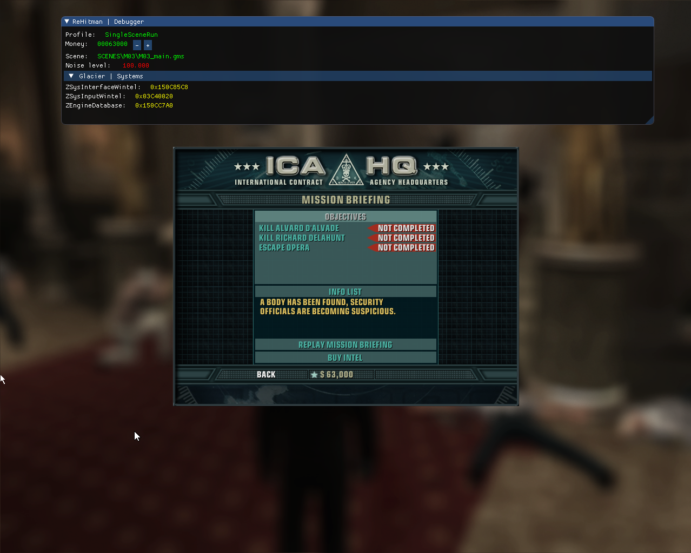

ReHitman
--------

What is it?
===========

This is my try to reverse the executable of Hitman Blood Money. The final goal of this project is multiplayer in this game (like a Mafia 2 Mutliplayer)

Game version
=============

Currently I am using Hitman Blood Money 1.2 ENG release (NOT STEAM!)

About directories
==================

This project includes 2 directories:

 * Launcher    - Main DLL injector and runner of game
 * HM3CoreKill - Core of my reverse library

The goals
=========

 - [x] Create open source SDK for Glacier 1 Engine
 - [ ] Reverse rendering API
 - [x] Implement ImGUI backend over Glacier renderer wrapper (ZWintelRendererD3D)
 - [x] Reverse input API (mouse, keyboard)
 - [ ] Reverse GUI API
 - [ ] Implement custom widget with logic on CoreKill.dll side
 - [ ] Reverse scene format
 - [ ] Create toolset for Hitman Blood Money

 Contacts
=========

You can contact with me in project issues tracker(any questions, ideas, etc).
