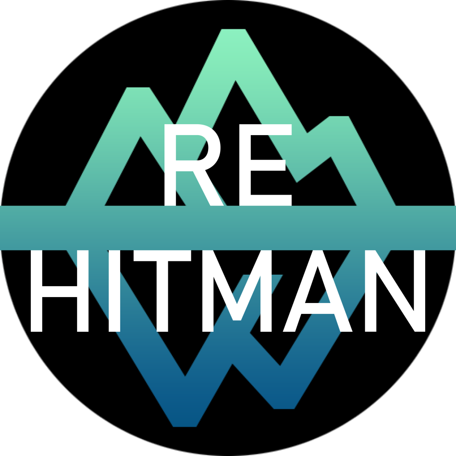

	

What is ReHitman?
---------------

ReHitman is an attempt to reverse the executable of "Hitman: Blood Money".

The final goal of the project is to develop a multiplayer similar to Mafia 2's Mutli-player.

Game Build Information.
---------------

This project is built on the last build of Hitman Blood Money that IO Interactive released.

Executable String:

	blood-build3-20060616-26123

Installation Instructions.
---------------
 * Ensure you meet (Game Build Information)[https://github.com/DronCode/ReHitman#game-build-information]
 * Place the pre-compiled files into the "Hitman: Blood Money" installation folder.
 * Run Launcher.exe
 
Usage.
---------------
 * Press F3 to launch the ReHitman Debug Menu

For developers
===============

You can build & debug ReHitman with game. 

For this just switch solution configuration to "DebugGame" and write path to folder with game into environment variable `ReHitmanGameFolder` 
 
Project Runtimes.
---------------

This project includes 2 runtimes:

 * Launcher
	- This simply just hooks "Hitman: Blood Money"

 * HM3CoreKill
 
	- This is the projects core for future development, this will be later useful for multiplayer development.
		- ck
			- (CoreKill) Future Multi-player development.
		- mp
			- Multiplayer development
		- sdk
			- Our IO-Interactive reversed engineered software development kit, this is used for controlling the Glacier Engine
		- third_party
			- Third Party runtimes etc
		- utils
			- Various tools for internal project use
	
Current Project Goals.
---------------

 - [x] Create an open source SDK for the Glacier 1 Engine
 - [ ] Reverse the rendering API
 - [x] Implement ImGUI backend over Glacier renderer wrapper (ZWintelRendererD3D)
 - [x] Reverse the input API (mouse, keyboard)
 - [ ] Reverse the GUI API
 - [ ] Reverse the scene format
 - [ ] Create a toolset for Hitman Blood Money

Contact Information.
---------------

The team can be contacted in the Project's issue tracker or via Discord (any questions, ideas, etc).

